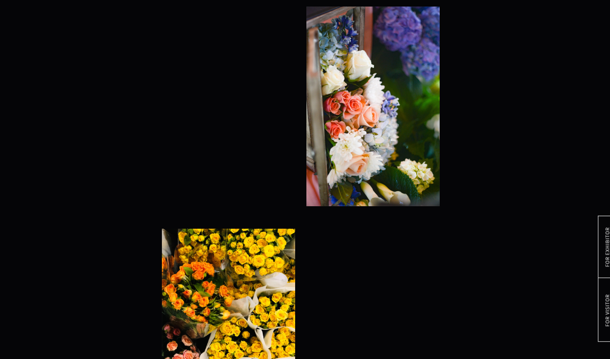

| 項目 | 値 |
|------|-----|
| フォント | Google Fonts「Source Sans Pro」 |
| コンテンツ幅 | 800px |　⇀★★ここは足されるの確認
(全幅以外の少し小さいところ) 

| サイドパディング | 30px |　⇀
| ブレイクポイント | 900px |　⇀全幅より少し小さいところ


/* コンテンツ幅を設定するための共通クラス */
.wrapper {
  max-width: 800px;  /* ← コンテンツ幅 */
  padding: 0 30px;   /* ← サイドパディング */
  margin: 0 auto;    /* ← 中央寄せ */
}

`★つまサイドパディングが横幅がつくので、800-60=740pxとなる。`


★　実表示幅	860px
```css
/* コンテンツ幅を設定するための共通クラス */
.wrapper {
  max-width: 800px;  /* ← コンテンツ幅 */
  padding: 0 30px;   /* ← サイドパディング */
  margin: 0 auto;    /* ← 中央寄せ */
}
```


以下のような画像があった場合
・コンテンツ幅は８６０PXである。
そのため、デザイン上は画像の配置が近いが、
８６０横幅一杯に広げる。中央に余白ができる




### Header

- 初期状態は `display: none` で非表示
- スクロール位置が**520px**に達した時に表示（jQuery fadeIn使用）
- スクロール位置は `$(window).scrollTop()` で取得

#### ハンバーガーメニュー

- クリック時に全画面メニューを上から下へスライド表示
- メニューは nav、ul、li タグで記述し、初期状態は非表示

### メインビジュアル（#mainvisual）

- 画像をFlexboxで横並び配置
- `overflow-x: hidden` で横スクロールを防止

-----------------------------------------------------------------

メインビジュアル、ヘッダー、INFORMATION、GALLERY、ACCESS、CONTACT、フッターなどのセクションがあります。

▢`ヘッダー`</span>

ヘッダーは、スクロール量に応じて出現する**追従型のナビゲーション**として実装します。

【構成と配置】
- `要素`: ロゴ、ハンバーガーメニュー
- `配置`: `position: fixed` を使用して画面の両端に固定。
- `重なり`: 他の要素（メインビジュアル等）より上に表示されるよう `z-index` の指定が必要。

【表示コントロール】
- `初期状態`: `display: none`（css）で非表示にしておく。
- `出現条件`: スクロール位置が **520px** に達した際に、jQueryの `fadeIn` を使ってふわっと表示させる。
- `判定`: `$(window).scrollTop()` を監視し、520以上なら表示、未満なら非表示にする制御が必要。

【ハンバーガーメニューの詳細】
- `見た目`: 3本線（spanタグ等で作成）のアイコン。
- `挙動`: クリックすると全画面メニューが**上から下へスライド**して表示される。
- `HTML構造`: セマンティックなHTMLにするため、メニュー部分は `nav` > `ul` > `li` > `a` の構造で作成する。
- `実装`: jQueryでクラスの付け外し（`toggleClass` 等）を行い、CSSまたはjQueryのアニメーションでスライドを表現する。

---

▢`メインビジュアル`</span>

スクロール量に合わせて画像が動的に変化する、視覚的効果の高いセクションです。

【レイアウト】
- `配置`: `Flexbox` を使用して画像を横に並べる。
- `はみ出し防止`: 画像拡大時に横スクロールバーが出ないよう、親要素に `overflow-x: hidden` を設定する。

【スクロールアニメーション】
- `演出`: スクロールに合わせて画像サイズを変更する。PCとSPで挙動が逆になる点に注意。
- `PC表示`: スクロールするほど画像が**拡大**する（widthを増加させる）。
- `SP表示`: スクロールするほど画像が**縮小**する（widthを減少させる）。
- `計算`: `$(window).scrollTop()` の値を利用して、リアルタイムにCSSの `width` を計算・更新する。

---

`INFORMATION`</span>

【構成】
- `タグ`: `section` で囲み、見出しは `h2` を使用。
- `テキスト`: フォントサイズや色が異なる箇所は `span` タグで個別にスタイルを当てる。

【出現アニメーション】
- `挙動`: 画面外（下）から要素が入ってきたタイミングで、ふわっと表示させる。
- `実装`: jQueryプラグインの **inview** を使用して、要素が可視領域に入ったことを検知する。

---

▢`GALLERY`</span>

【レイアウト】
- `配置`: 画像を交互（左・右・左...）に配置する。
- `手法`: CSSの `nth-child(odd)`（奇数・左寄せ）と `nth-child(even)`（偶数・右寄せ）を活用して、効率的にスタイリングする。

【アニメーション】
- `挙動`: INFORMATIONと同様に、画面内に入ったタイミングで下からふわっと表示（inviewプラグイン使用）。

---

▢`サイドボタン`</span>

PC表示時のみ、特定のセクション間でのみ出現する浮遊ボタンです。

【表示条件】
- `出現`: **GALLERYタイトル**が画面に入ったタイミングで、右からスライドして表示。
- `消失`: **ACCESSタイトル**が画面に入ったタイミングで、スライドして消える。
- `レスポンシブ`: スマホ（SP）では `display: none` で完全に非表示。

---

▢`ACCESS`</span>

セクションの背景が、スクロール位置によって全画面画像へ切り替わる特殊な演出があります。

【背景切り替え】
- `演出`: **ACCESSタイトル**が来たら背景をフェードイン表示、**CONTACTタイトル**が来たらフェードアウト。
- `背景の固定`: `position: fixed`、`width: 100vw`、`height: 100vh` を使い、コンテンツの背後で常に全画面表示されるようにする。

---

▢`CONTACT`</span>

【ボタンの装飾】
- `矢印`: CSSの疑似要素（`::before` で直線、`::after` で先端）を組み合わせて作成する。
- `ホバー効果（PC）`: 透過度を変更し、矢印を少し右に移動（`right` 値の変更）させるアニメーションを加える。

---

▢`フッター`</span>

【構成とレイアウト】
- `要素`: 左側にコピーライト等のテキスト、右側にナビゲーションリストを配置。
- `配置`: `Flexbox` を使用して両端に振り分ける。

